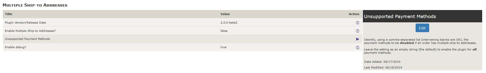
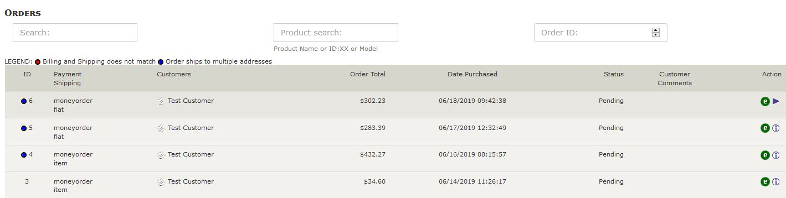
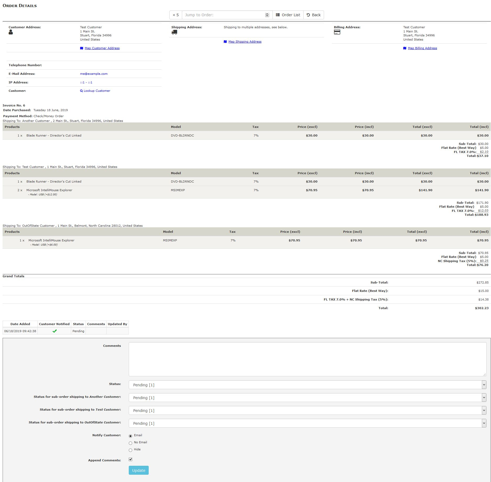
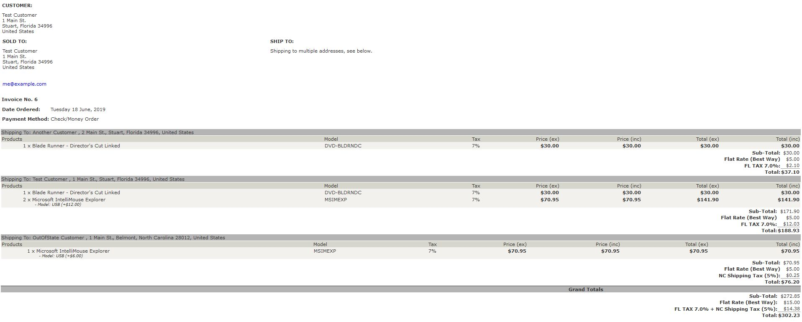
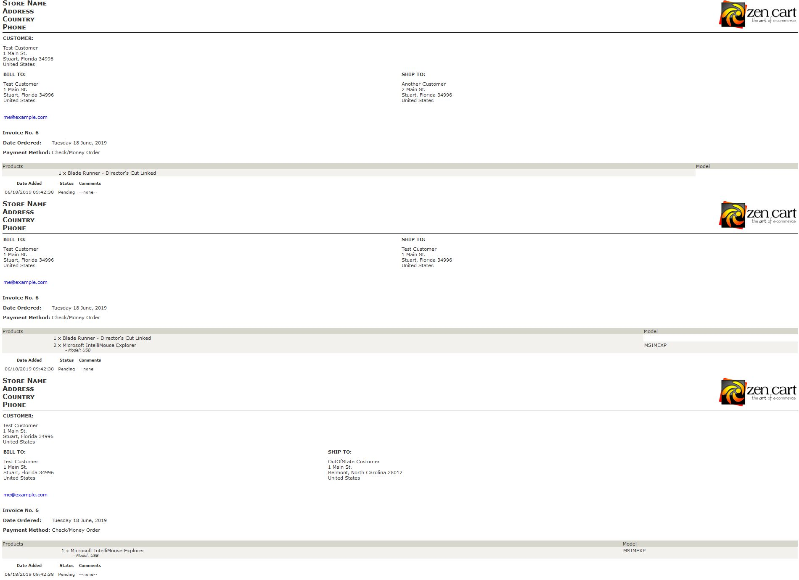

# Multiple Shipping Addresses: Admin Interface Changes

This document identifies changes made to your Zen Cart admin's interfaces once _**Multiple Shipping Addresses**_ is installed.

- [Configuration->Multiple Ship-to Addresses](#configuration-multiple-ship-to-addresses)
- [Customers->Orders](#customers-orders)
	- [Invoices](#invoices-for-orders-with-multiple-shipping-addresses)
	- [Packing Slips](#packing-slips-for-orders-with-multiple-shipping-addresses)

## Configuration: Multiple Ship to Addresses

When Multiple Shipping Addresses, v2.0.0 or later, is initially installed it creates a configuration group for the plugin's settings:

**Note**: On initial install (or upgrade from a previous version), the setting that enables the plugin's overall operation is disabled!

You can use the _Unsupported Payment Methods_ setting to identify any payment methods that should be disabled when an order includes multiple shipping addresses.

## Customers::Orders

Changes are made to your admin's `/admin/orders.php`. When you view the orders for your Zen Cart, the orders' listing display identifies those orders that have multiple ship-to addresses using a blue dot, as shown by the screenshot that follows.

If you click either the **Invoice** or **Packing Slip** buttons, the page's navigation takes you to different admin pages depending on whether or not the order has been shipped to multiple addresses &mdash; `invoice_multiship.php` and `packingslip_multiship.php` or `invoice.php` and `packingslip.php`, respectively.  This allows the restructuring of the invoice and packing-slip printouts without modifying (yet another) core file!

**Note:** Orders with multiple shipping addresses **cannot be edited** using _Edit Orders_!  The _**Multiple Shipping Addresses**_ processing will deny any request to edit such an order.

When you click the _default_ **edit** button for an order that has multiple ship-to addresses, the information is displayed as shown by the screenshot that follows. If you click either the **Invoice** or **Packing Slip** buttons, the page's navigation takes you to an admin page that provides the multiple ship-to address formatting &mdash; as described above.

There are a couple of differences between this display and that provided for a product that ships to a single address.

1. The **Shipping Address:** field displays _Shipping to multiple addresses, see below_.
2. The **Products** and order-totals are split out for each shipped-to address.
3. A **Grand Total:** section is inserted to identify the overall billed amounts.
4. The orders-status for each sub-order and for the overall order can be separately viewed and changed.
5. If a sub-order's status is changed, the change is recorded in an orders_status_history record for the order.

### Invoices for Orders with Multiple Shipping Addresses

When you click an **Invoice** button for an order that has multiple ship-to addresses, the information is displayed as shown by the screenshot that follows.  There are a couple of differences between this display and that provided for a product that ships to a single address:
1. The Shipping Address: field displays _Shipping to multiple addresses, see below._.
2. The **Products** and order-totals are split out for each shipped-to address.
3. A Grand Total: section is inserted to identify the overall billed amounts.

### Packing Slips for Orders with Multiple Shipping Addresses

When you click a **Packing Slip** button for an order that has multiple ship-to addresses, the information is displayed as shown by the screenshot that follows.  There are a couple of differences between this display and that provided for a product that ships to a single address:

4. The information is broken out by each **Ship To:** address.
5. A page-break is inserted between each sub-order's information, so an order that ships to two addresses will have two packing slips.

