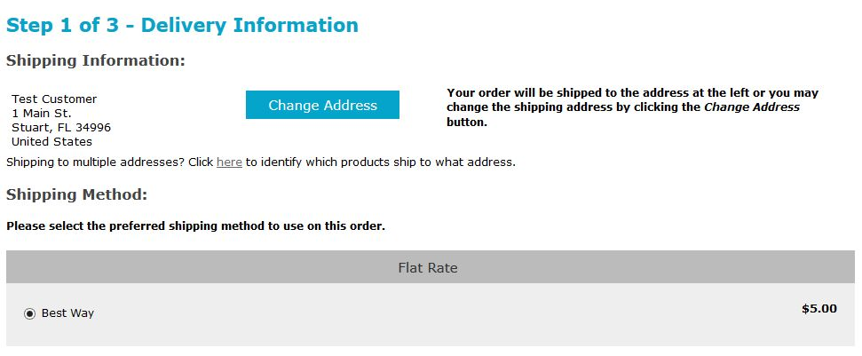
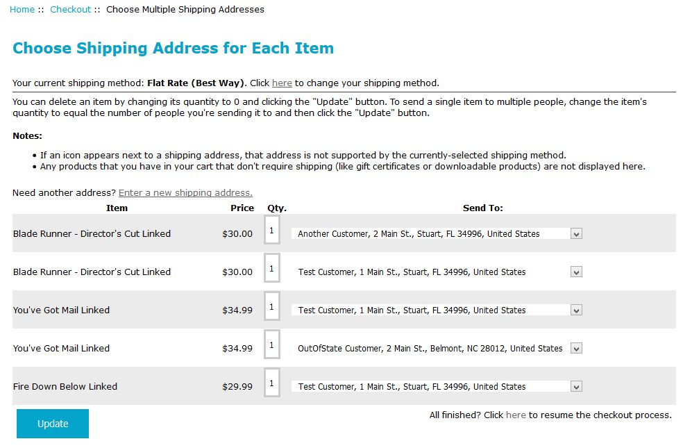
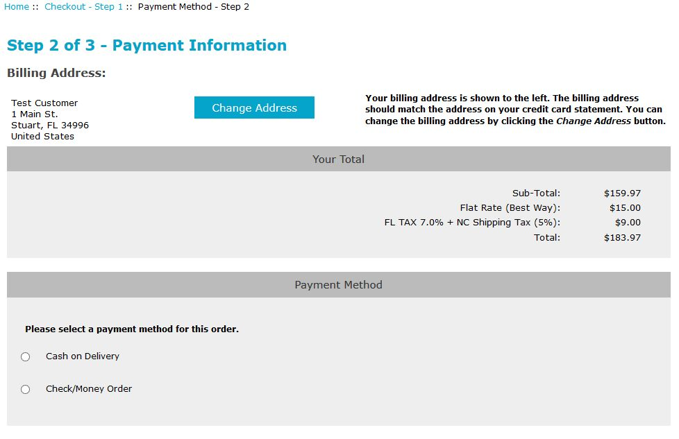
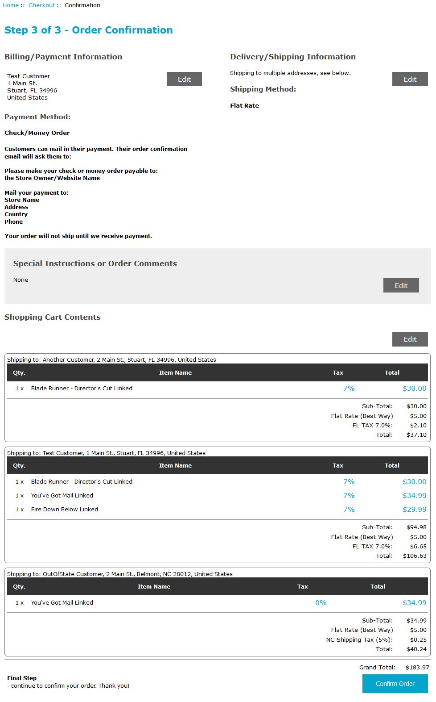
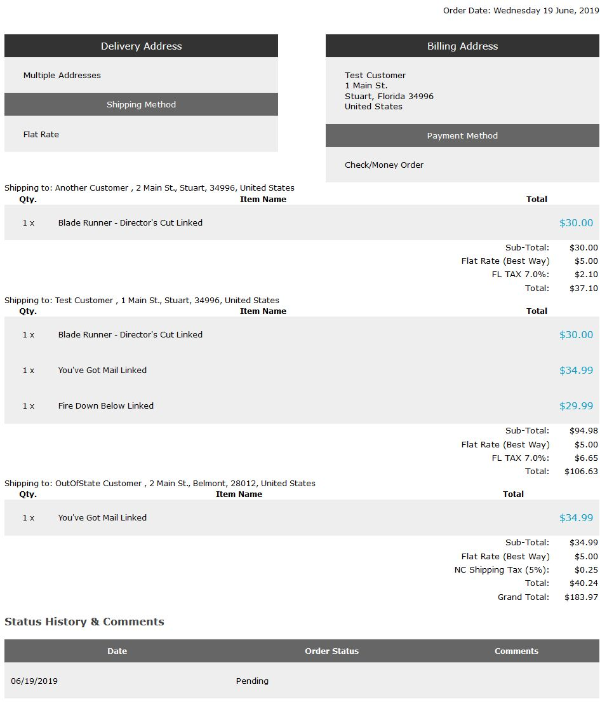

# Multiple Shipping Addresses: Storefront Interface Changes

This document identifies changes made to your Zen Cart storefront interfaces once _**Multiple Shipping Addresses**_ is installed.

- [During the Checkout Process](#during-the-checkout-process)
	- [Checkout Shipping](#checkout-shipping)
		- [Initial Offer](#initial-offer)
		- [Multiple Shipping Addresses Supplied](#multiple-shipping-addresses-supplied)
	- [Multiple Shipping Address Entry](#multiple-shipping-address-entry)
	- [Checkout Payment](#checkout-payment)
	- [Checkout Confirmation](#checkout-confirmation)
- [Displaying Orders Created with Multiple Shipping Addresses](#displaying-orders-with-multiple-shipping-addresses)

## During the Checkout Process

When Multiple Shipping Addresses, v2.0.0 or later, is installed (and enabled) your store's checkout-process changes slightly to give the customer the opportunity to identify multiple shipping addresses for the order.

### Checkout Shipping

The information displayed on your store's `checkout_shipping` page is modified based on whether the customer has previously supplied multiple shipping addresses for their order.

#### Initial Offer

Starting with v2.0.0 of Multiple Shipping Addresses, the _offer_ for the customer to identify those multiple addresses is shown on the initial display of the `checkout_shipping` page, _so long as_ **all** the following conditions are met:

1. The plugin is enabled, via admin-configuration.
2. The customer has not _yet_ supplied multiple shipping addresses for the order.
2. There is more than one **physical** product in the customer's cart. Note that any item that is **mixed**, e.g. a physical product with a download included, does not qualify for the multiple ship-to addresses!
3. The customer is not using a guest checkout (either COWOA or PayPal Express Checkout).
4. The customer is not part of a _group pricing_ group.
5. The customer, on a previous entry to the checkout process, has not "registered" a coupon for use on the order.

If those conditions are satisfied, the customer is _offered_ the opportunity to specify multiple shipping addresses for the order.

#### Multiple Shipping Addresses Supplied

If the customer has [supplied](#multiple-shipping-address-entry) multiple shipping addresses for the order, the display on the `checkout_shipping` page changes slightly, giving the customer the opportunity to make changes to those product-to-address choices.

The cost for the currently-selected shipping choice changes to reflect the cost for those multiple shipments.  For the example case, flat-rate shipping is set as $5.00 per order.  Since the example uses three (3) separate shipping addresses, the shipping-cost for the order is $15.00.

### Multiple Shipping Address Entry

When a customer clicks the multiple shipping-address link provided on the `checkout_shipping` page, they're taken to the `checkout_multiship` page where they can identify which product(s) ship to which addresses.  That page's display breaks down the customer's order into a collection of single-quantity line items so that the customer can choose the ship-to address for each item in their cart.

- Initially, all items ship to the customer's current delivery address (as selected on the `checkout_shipping` page).
- The customer can change the currently-selected shipping method by clicking the link at the top of the page.
- The customer uses the dropdown list of addresses &mdash; created from their current address book &mdash; to choose the address to which each individual item is to ship.
- An item (and its associated ship-to information) **is removed** by setting its quantity box to 0 and clicking the _Update_ button.
- The quantity of an item currently in the cart **can be increased** by changing one of the item's quantity boxes to a value greater than one (1) and clicking the _Update_ button.  For example, changing the quantity of one of the items to `2` will increase the quantity of that item by one (1).
- Clicking the _Enter a new shipping address_ link will take the customer to their address book, where they can create a new address if needed.
- No _virtual_ or _mixed_ products in the customer's cart are listed on this page, since a virtual product has no ship-to address.  All virtual products in a _mixed_ cart (i.e. having a combination of physical and virtual products) will be associated with either the customer's default address (if one or more physical items is being shipped to that address) or the the address that has the lowest `address_id`.  If the customer chooses to send all items to a single address, then all virtual products are also &quot;sent&quot; to that address.
- Once the customer has chosen the send-to addresses for each item in their cart, they click the **All finished** link to return to the `checkout_shipping` page. If any address chosen is not compatible with the currently-selected shipping method, the customer will be returned to the `checkout_multiship` page to correct the problem.

### Checkout Payment

If the customer has chosen multiple shipping addresses for the order, the display of the order's totals on the `checkout_payment` page shows the total for all sub-orders.  Additionally:
1. Any payment methods that are configured as "not allowed" for orders with multiple shipping addresses are not shown.
2. If your store has enabled coupons for customers' orders, that selection is not provided.

### Checkout Confirmation

If the customer has chosen multiple shipping addresses for the order, the `checkout_confirmation` page displays the breakdown of which products ship to which address, along with the totals for each sub-order:

## Displaying Orders Created with Multiple Shipping Addresses

When an order with Multiple Shipping Addresses is created, the order's display (either on the `checkout_success` or `account_history_info` page) includes the sub-order breakdown for the customer's review, similar to the following screenshot:

